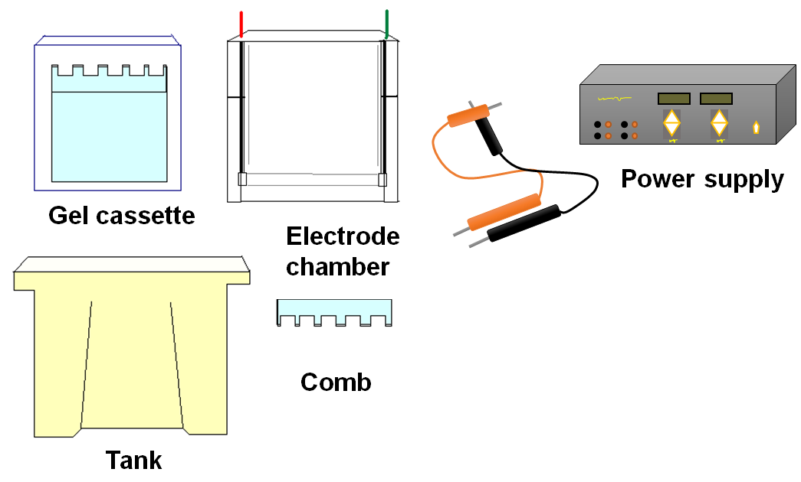
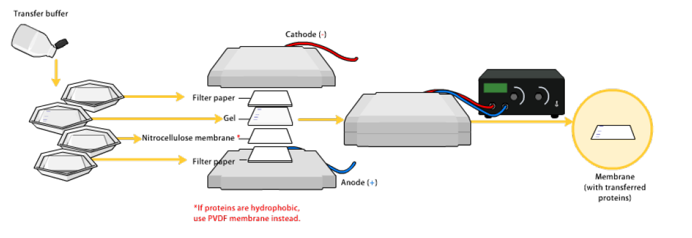
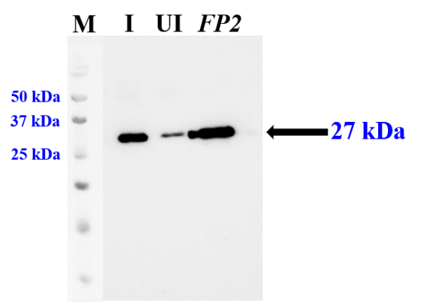

### Procedure

**Materials required for experiments:**

1. E. coli cells over-expressing protein such as LDH.
2. Protein standard markers.
3. Transfer buffer.
4. Transfer membrane: 0.45 µm nitrocellulose membrane or PVDF membrane.
5. Plastic tray.
6. Spatula.
7. Blotting sheets: 3 mm thick cellulose blotting sheets.
8. Semi-dry electroblotting unit.
9. Reagents for performing electrophoresis.
10. Anti-LDH antibodies.
11. Anti-rabbit IgG-HRP.
12. Developing reagents.

## Day 1

### STEP 1: Preparation of protein sample

**1A. Lysis of cells:** Lysis method depends on the sample type.

**For Tissue:** For solid tissue such as tumor or whole liver, brain, it is first mechanically broken down into individual cells using a blender, homogenizer or by sonication. Once individual cells are obtained it will be processed as described below.

**For Cells:** Individual cells are incubated with the lysis buffer containing detergent along with protease and phosphatase inhibitor cocktail to protect the sample from degradation.

### STEP 2: Sample analysis by SDS-PAGE

Sample was resolved on SDS-PAGE as described below. Different components of SDS-PAGE are given in Figure 2.

#### 2.1 Materials Required for SDS-PAGE:

**Buffer and reagent for electrophoresis-** The different buffer and reagents with their purpose for vertical gel electrophoresis is as follows-

1. N, N, N', N'-tetramethylethylenediamine (TEMED)-It catalyzes the acrylamide polymerization.
2. Ammonium persulfate (APS)-It is an initiator for the acrylamide polymerization.
3. Tris-HCl- It is the component of running and gel casting buffer.
4. Glycine- It is the component of running buffer.
5. Bromophenol blue- It is the tracking dye to monitor the progress of gel electrophoresis.
6. Coomassie brilliant blue R250-It is used to stain the polyacrylamide gel.
7. Sodium dodecyl sulphate-It is used to denature and provide negative charge to the protein.
8. Acrylamide- Monomeric unit used to prepare the gel.
9. Bis-acrylamide- Cross linker for polymerization of acrylamide monomer to form gel.

#### 2.2 Casting of PAGE Gels:

1. In a vertical gel electrophoresis system, we cast two types of gels, stacking gel and resolving gel.
2. First the resolving gel solution is prepared and poured into the gel cassette for polymerization.
3. A thin layer of organic solvent (such as butanol or isoproponal) is layered to stop the entry of oxygen (oxygen neutralizes the free radical and slow down the polymerization) and make the top layer smooth.
4. After polymerization of the resolving gel, a stacking gel is poured and comb is fitted into the gel for construction of different lanes for the samples.

<b>Figure 2: Components of Gel Electrophoresis</b>

#### 2.3 Running of SDS-PAGE:

### STEP 3: Transfer of protein gel on blotting membrane

**3.1 Preparation of transfer membrane:** We have two different types of membrane options to use for western blotting. These membranes are Nitrocellulose and PVDF. We use different processing protocol to use the membrane for transfer the SDS-PAGE gel. It is as follows:

**A1: For nitrocellulose membrane:** Cut the membrane of the same size as gel. Place the membrane in the transfer buffer and observe that the liquid has wicked the membrane. Areas appeared as white spot needs special consideration.

**A2: For PVDF membrane:** Cut the membrane of the same size as gel. Immerse the membrane into the 100% methanol for 15-30 mins. Decant the methanol and submerge the membrane into the transfer buffer for additional 10-30 mins.

**3.2 Assembly of transfer cassette:** Different steps in transferring protein from SDS-PAGE to the membrane is given in the Figure 3. These steps are as follows:

1. Remove the stacking gel from the PAGE and equilibrate the gel in transfer buffer for 10-30 mins.
2. Place a pair of blotting sheet (already saturated with transfer buffer) on the anode plate (usually this plate is black colored).
3. Place the transfer membrane on the top of blotting sheets and remove trapped air bubble by rolling test tube or glass rod.
4. Place the PAGE gel on the top of membrane and gently remove trapped air bubble by rolling test tube or glass rod.
5. Place another blotting sheet (already saturated with transfer buffer) on the top and remove trapped air bubble by rolling test tube or glass rod.
6. Finally keep cathode plate (usually red colored) and tight the transfer cassette by four screws.

**3.3 Transfer protein from gel to the membrane:**

Place the transfer cassette in the tank filled with the transfer buffer. Connect the transfer apparatus to the power supply unit and apply constant voltage (100 volts for 1 hrs). After transfer, disassembly the whole cassette and carefully remove transfer membrane and check the protein transfer by ponseau S stain. Use a pencil and label different lanes.

<b>Figure 3: Steps in electroblotting of protein on the membrane.</b>

### STEP 4: Blocking

Wash the membrane with distilled water to remove any remaining ponseau S stain. Put the membrane in blocking buffer containing 5% skimmed milk (for detection of cytosolic protein) or 5% fat free BSA (for detection of phosphorylated proteins) for 30 mins at 37 °C or overnight at 4 °C.

### STEP 5: Probing with primary antibody

Membrane is probed with the primary antibody to recognize the protein of interest. Membrane is probed with the primary antibody with an appropriate dilution for 1 hrs at room temp (RT).

### STEP 6: Washing

Membrane is washed 4-6 times with buffer containing non-anionic detergent Triton X-100 at 37 °C.

### STEP 7: Probing with secondary antibody

Membrane is probed with another antibody directed against the primary antibody. The secondary antibody is coupled with an enzyme (either HRP or alkaline phosphatase) or a fluorescent dye. Washed membrane is incubated with the secondary antibody with an appropriate dilution for 1 hrs at room temp (RT).

### STEP 8: Washing

Membrane is washed 4-6 times with buffer containing non-anionic detergent Triton X-100 at 37 °C.

### STEP 9: Blot development

There are multiple ways to develop the blot and detect the protein present on the membrane.

**A. Colorimetric detection:**

Wash the membrane with TBS to remove detergent. Place the membrane into the colorimetric reagent and protein bands appeared in 10-30 mins. Stop the reaction by washing in distilled water. Air dry the membrane and photograph for permanent record.

**B. Chemiluminescent detection:**

The different chemiluminescent reagents are given in Table 1. Transfer the membrane into the chemiluminescent reagent. Soak the membrane for 30 sec to 5 mins. Drain off the reagent and wrap the membrane into the plastic wrap. Place it in film cassette and expose the membrane to film for a few seconds to several hours.

**C. Fluorescent detection:**

Secondary antibodies labeled with fluorescent dye and captured in the scanner.

**Result:** The developed blot is given in the given Figure 4 where anti-His antibodies are been used to detect over-expression of malarial protein in *E. coli* expression system.

<b>Figure 4: Detection of Protein over-expression in <i>E. coli</i> expression system.</b> Lane M = Marker, lane I = Induced sample, lane UI = Uninduced sample and lane <i>FP2</i> = Purified <i>Falcipain II</i>.

