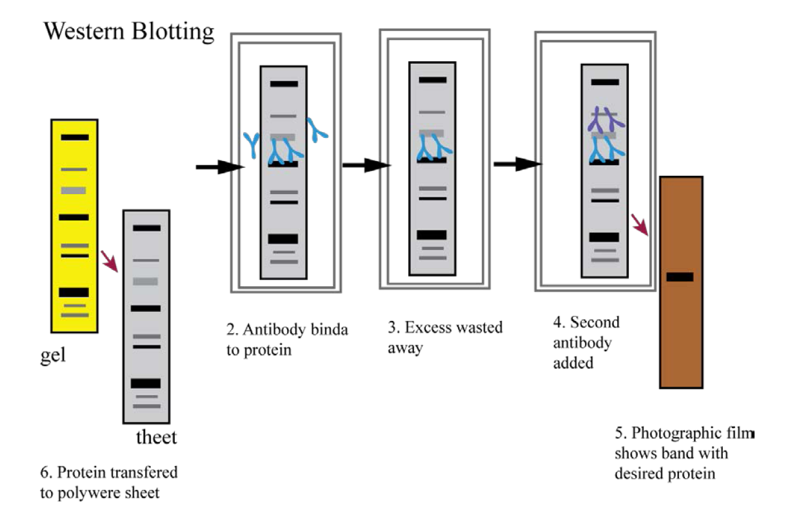

### Theory

The western blot is a popular technique to detect the specific protein present in the crude lysate or homogenate. It uses the separation of different proteins in the gel electrophoresis (preferably SDS-PAGE) and then the transfer of protein onto a solid support such as a nitrocellulose membrane. It utilizes 2 different antibodies: a primary antibody to recognise the protein of interest and a secondary antibody to recognize the primary antibody. In most cases, a secondary antibody is coupled to an enzyme and it catalyzes chemical reaction to give color product or chemiluminescent signal. It is 10 step techniques as depicted in Figure 1:

<b>Figure 1: Steps in Western Blotting</b>

1. Cells are collected from culture plate and lysed by adding lysis buffer. Sample was centrifuged at 8000 rpm to remove debris and clear cytosolic fraction was collected in clear Eppendorf.
2. Complex protein mixture from cell lysate or tissue lysate was resolved on SDS-PAGE to resolve the proteins as per their molecular weight.
3. The protein bands on SDS-PAGE gel is transferred on the nitrocellulose membrane.
4. The membrane is blocked with skimmed milk to avoid non-specific interaction of antibodies on the free membrane surface.
5. The membrane is probed with primary antibody at 1:5000 dilutions for overnight at 4 °C.
6. Membrane is washed with washing buffer for 7-8 times.
7. The membrane is probed with secondary antibody at 1:8000 dilutions for overnight at 4 °C.
8. Membrane is washed with washing buffer for 7-8 times.
9. Blot was developed by adding colorimetric substrate or chemiluminescent substrate as given in Table 1.
10. Images were captured using gel-doc.

### Table 1: Different Reagents Available to develop western blot

| System | Reagent | Reactions |
| ------ | ------- | --------- |
| **Chromogenic** | | |
| HRP Based | 4-chloro-napthol DAB/NiCl2 TMB | Oxidized product to form purple precipitate Forms dark brown precipitate Forms dark purple stain |
| Alkaline phosphatase | BCIP/NBT | BCIP hydrolysis produces indigo precipitate after oxidation with NBT. |
| **Luminescent** | | |
| HRP Based | Luminol/H2O2 | Oxidized luminol gives off blue light. |
| Alkaline phosphatase | Substituted 1,2 dioxetane phosphate | Dephosphorylated substrate gives off light. |
